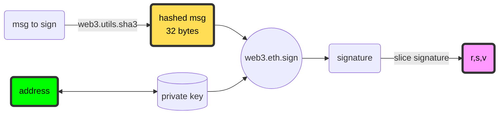
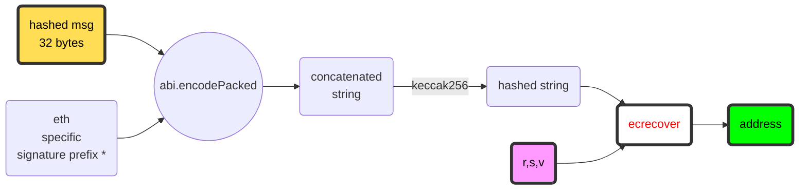
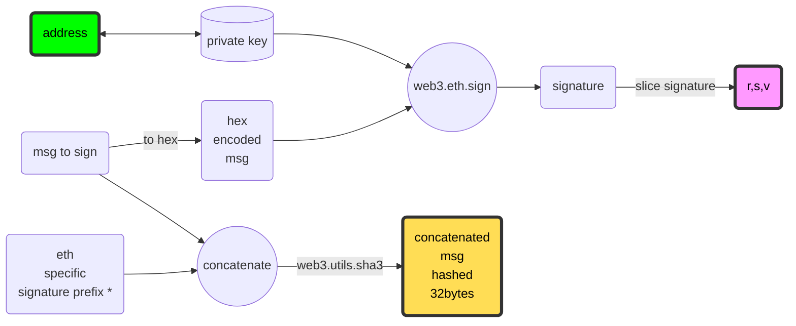
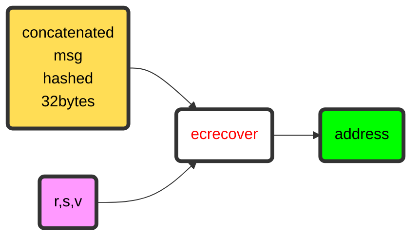
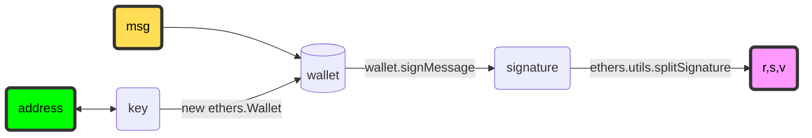
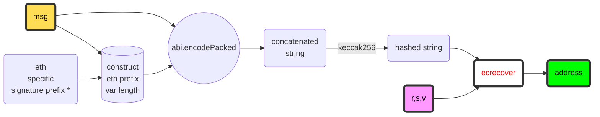

# Signing a message and veryfying signer's address in ethereum

## About
This repo contains 3 different ways of signing a message *off-chain* and verifying signer's address *on-chain* using solidity `ecrecover`
## Requirements

- Truffle installed (you can install it as `npm -i -g truffle`)
- Ganache running on port 7545
- install dependencies (`npm install`)
- `.env` file containing private key for account[0] from Ganache 

## Usage

```
truffle test
```

## Examples

---
--- 

### Use case 1

- Use `web3.js` for off-line signing
- Hash the message before signing
- Use *unlocked* account from ether client (i.e. ganache) for signing

#### Process flow chart

- Off line signature (`test/testVerifier1.js`) 


***

- On chain verification (`contracts/Verifier1.sol`)



---
--- 

### Use case 2
- Use `web3.js` for off-line signing
- Use *unlocked* account from ether client (i.e. ganache) for signing
- Append `eth specific prefix` *off-line* before passing data *on-chain*

#### Process flow chart

- Off line signature (`test/testVerifier2.js`) 



***

- On chain verification (`contracts/Verifier2.sol`)



--- 
--- 

### Use case 3
- Use `ethers.js`
- Does not require unlocked account
- Sign message off line via `wallet.signMessage`
- Get signature components with `ethers.utils.splitSignature`
- Pass arbitrary length message to verifier contract (i.e. not fixed to 32 bytes)
- Use in-line assembly to deconstruct and reconstruct message to verify

#### Process flow chart:

- Off line signature (`test/testVerifier3.js`)



***

- On chain verification (`contracts/Verifier3.sol`)


\* `\x19Ethereum Signed Message:\n" + len(hashedMessage)`
